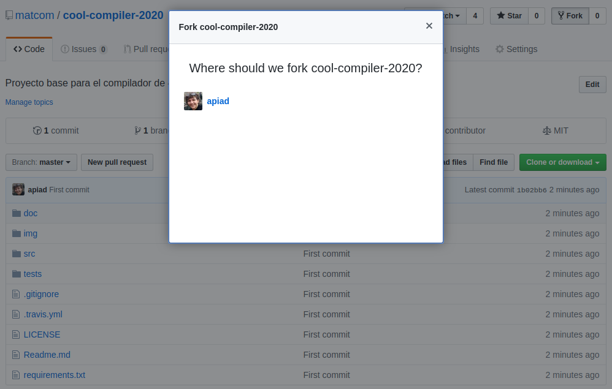
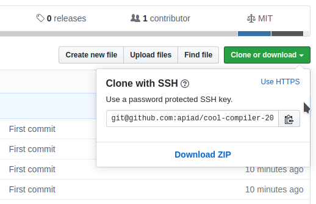
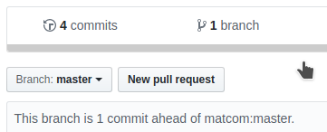
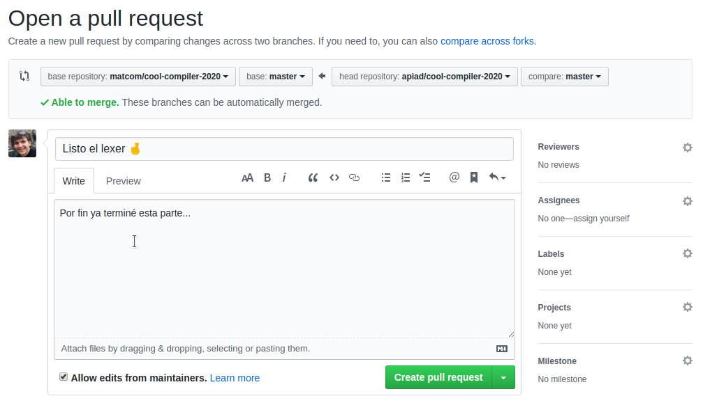
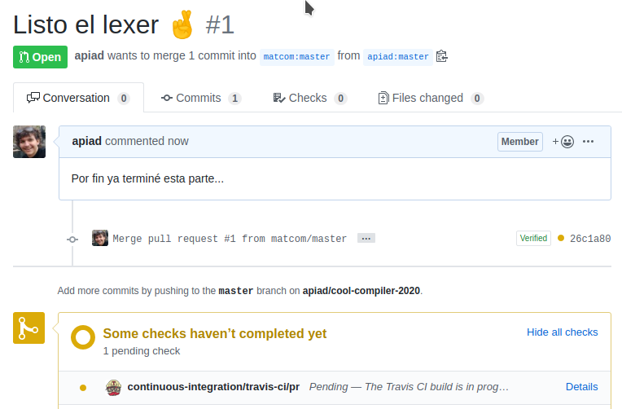
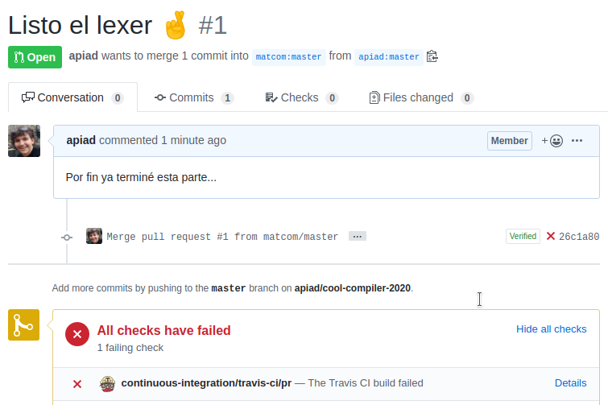
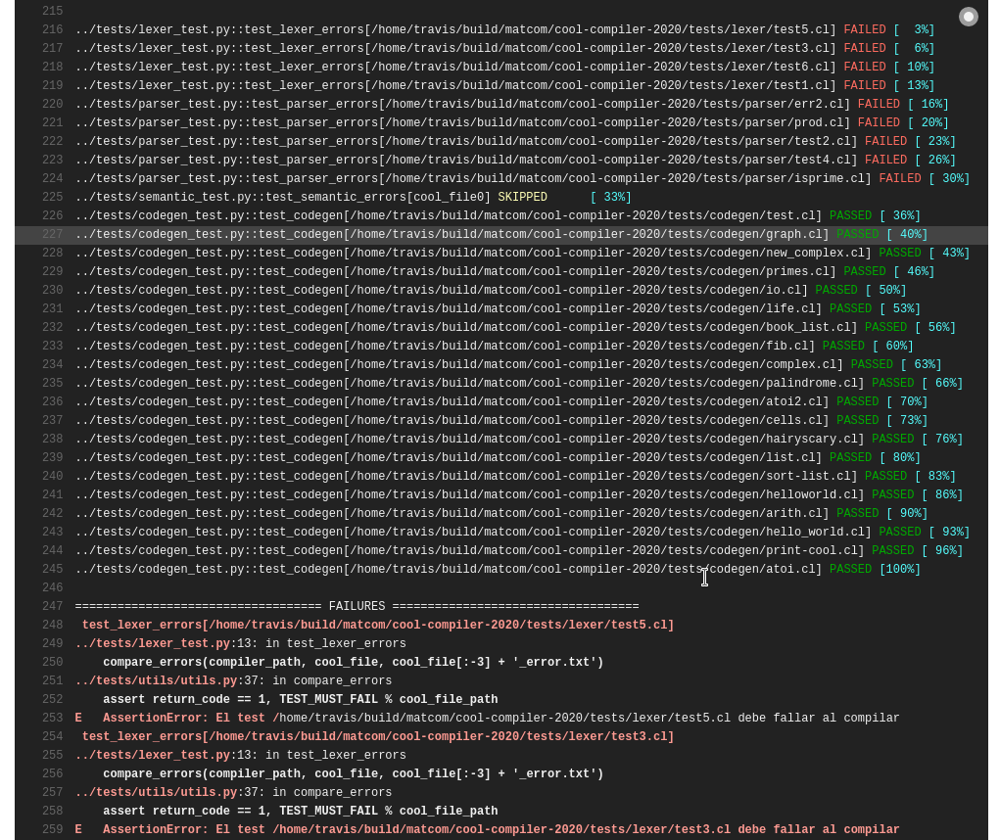

# COOL: Proyecto de Compilación

<!-- Update the repository URL to your own -->
[](https://travis-ci.org/matcom/cool-compiler-2020)

> Proyecto base para el compilador de 4to año en Ciencia de la Computación.

## Generalidades

La evaluación de la asignatura Complementos de Compilación, inscrita en el programa del 4to año de la Licenciatura en Ciencia de la Computación de la Facultad de Matemática y Computación de la
Universidad de La Habana, consiste este curso en la implementación de un compilador completamente
funcional para el lenguaje _COOL_.

_COOL (Classroom Object-Oriented Language)_ es un pequeño lenguaje que puede ser implementado con un esfuerzo razonable en un semestre del curso. Aun así, _COOL_ mantiene muchas de las características de los lenguajes de programación modernos, incluyendo orientación a objetos, tipado estático y manejo automático de memoria.

## Cómo comenzar (o terminar)

El proyecto de Compilación será recogido y evaluado **únicamente** a través de Github. Es imprescindible tener una cuenta de Github para cada participante, y que su proyecto esté correctamente hosteado en esta plataforma. A continuación le damos las instrucciones mínimas necesarias para ello:

### 1. Si no lo han hecho ya, regístrense en [Github](https://github.com) todos los miembros del equipo (es gratis).


### 2. Haga click en el botón **Fork** para hacer una copia del proyecto en el perfil de Github de uno de los miembros.

Opcionalmente pueden [crear una organización](https://github.com/organizations/new) y copiar el proyecto en el perfil de la misma.



### 3. Una vez hecho esto, tendrá un nuevo repositorio en `github/<usuario>`.

Revise que el repositorio de su equipo está en su perfil.
En este ejemplo se ha copiado a la cuenta de `github.com/apiad`.

Debe indicar bajo el nombre del repositorio: `"forked from matcom/cool-compiler-2020"`.


### 4. Clone este proyecto en un repositorio local.

Busque la URL de su proyecto en la interfaz web de Github.

Asegúrese de clonar **su copia** y no el proyecto original en `matcom/cool-compiler-2020`.



```bash
$ git clone git@github.com:<usuario>/cool-compiler-2020.git
```

> Donde `<usuario>` es posiblemente el nombre de su equipo o del miembro donde se hizo el _fork_.

A partir de este punto debe tener un proyecto `cool-compiler-2020` local.
El siguiente paso depende de si usted ya tiene su código versionado con `git` o no.

### 5.A. Si tiene su proyecto en git (y no quiere perder la historia):

#### 5.1. Mezcle hacia el nuevo respositorio su repositorio anterior:

```bash
$ cd cool-compiler-2020
$ git pull --allow-unrelated-histories <my-old-compiler-project> master
```

#### 5.2. Organice su proyecto, código fuente y documentación, de acuerdo a las instrucciones de este documento, y vuelva a hacer `commit`.

```bash
$ mv <my-old-code> src/
$ git add .
$ git commit -a -m "Mezclado con el proyecto base"
```

#### 5.3. A partir de este punto puede hacer `push` cada vez que tenga cambios que subir.

```bash
$ git push origin master
```

### 5.B Si aún no tiene su proyecto en git (o no le importa la historia):

#### 5.1. Simplemente copie el código de su proyecto en la carpeta correspondiente `src` y haga su primer commit.

```bash
$ mv <my-old-code> src/
$ git commit -a -m "Hello Git!"
```

#### 5.2. A partir de este punto asegúrese de hacer `commit` de forma regular para mantener su repositorio actualizado.

Si necesita saber más sobre `git`, todo lo imprescindible está en [esta guía](doc/github-git-cheat-sheet.pdf).

#### 5.3. A partir de este punto puede hacer `push` cada vez que tenga cambios que subir.

```bash
$ git push origin master
```

## Entregas

En este proyecto se realizarán entregas parciales a lo largo del curso. Para realizar una entrega, siga los siguientes pasos.

### 1. Cree un pull request al proyecto original desde su copia.



### 2. Asegúrese de tener la siguiente configuración antes de hacer click en **Create pull request**.

- **base repository**: `matcom/cool-compiler-2020` (repositorio original)
- **head repository**: `<usuario>/cool-compiler-2020` (repositorio propio)

> Asegúrese que se indica **Able to merge**. De lo contrario, existen cambios en el repositorio original que usted no tiene, y debe actualizarlos.


### 3. Introduzca un título y descripción adecuados, y haga click en **Create pull request**.



### 4. Espere mientras se ejecutan las pruebas.

Verá la indicación **Some checks haven't completed yet**.



### 5. Verifique que no hubo errores en las pruebas.

Si ve el mensaje **All checks have failed**, significa que su código no pasó las pruebas.



Para ver los resultados de las pruebas haga click en el link **Details** junto al ícono de `continuous-integration/travis-ci/pr`, o visite [este link](https://travis-ci.org/matcom/cool-compiler-2020/pull_requests) y busque su _pull request_.


Haciendo click en el título de su _pull request_ (ej. **PR #1**) podrá ver los detalles de ejecución de todas las pruebas, así como las excepciones lanzadas.



### 6. Arregle los errores y repita el paso 5 hasta que todas las pruebas pasen.

Para cualquier modificación que haga a su proyecto, haga _commit_ y _push_ para **su repositorio personal** y automáticamente se actualizará el estado del _pull request_ y se volverán a ejecutar las pruebas. **No es necesario** abrir un _pull request_ nuevo por cada entrega, sino actualizar el anterior.

## Sobre la implementación

Ponga todo su código e instrucciones necesarias en la carpeta `src`. Más información en [`src/Readme.md`](src/Readme.md).

## Sobre la documentación

Usted debe presentar un reporte escrito documentando el proceso de construcción de su compilador y los detalles más importantes de su funcionamiento. Más información en [`doc/Readme.md`](doc/Readme.md).

## Sobre los equipos de desarrollo

Para desarrollar el compilador del lenguaje COOL se trabajará en equipos de 2 o 3 integrantes.

## Sobre los casos de prueba

La carpeta `tests` contiene todos los casos de prueba que son obligatorios de pasar para que su proyecto tenga derecho a ser evaluado.

Estos tests se ejecutan automáticamente cada vez que hace un _pull request_ al repositorio `matcom/cool-compiler-2020`. Solo aquellos proyectos que pasen todas las pruebas con éxito serán evaluados.

Para ejecutar las pruebas localmente, debe tener instalado `Python 3.7`, `pip` y `make` (normalmente viene con Linux). Ejecute:

```bash
$ pip install -r requirements.txt
$ cd src
$ make test
```

Si desea configurar su repositorio en Github para que ejecute automáticamente las pruebas en cada commit, siga las instrucciones en [travis-ci.org](https://travis-ci.org) para registrarse y activar su repositorio. El archivo `.travis.yml` que se encuentra en este repositorio ya contiene todas las instrucciones necesarias para que funcione la integracion con Travis-CI.
